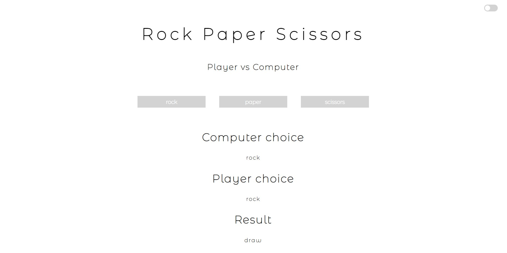
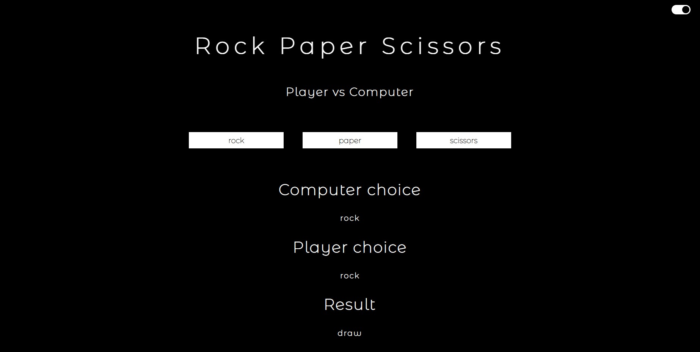

# [Live DEMO](https://rusdiana97.github.io/rps-game.github.io/)
# Rock Paper Scissors Game :rock: :page_facing_up: :scissors:

**Rock Paper Scissors** is a childhood game. Personally, the game reminds me of the moments when together with my childhood friends we would gather in front of the block from morning until late at night. We played it so that the one who loses will be chosen as the one who will have to do a "hard" thing, for example to go to the mother of another child and ask her to leave the child out.

So it is a common game that you can find today also developed on computers. Nothing new.

However, I tried to add a personal touch -> I have two moods:

- **_white_**: it means that I am happy, open, so in a good mood

- **_black_**: it doesn't mean that I'm in a bad mood, but I prefer privacy, time only with me, silence

Choose your mood from the mood toggle:

Then play this game with the Computer.

Choose one of these buttons: 
1. rock;
2. paper;
3. scissors.

**Try not to lose!**

**Have fun and good luck!**
